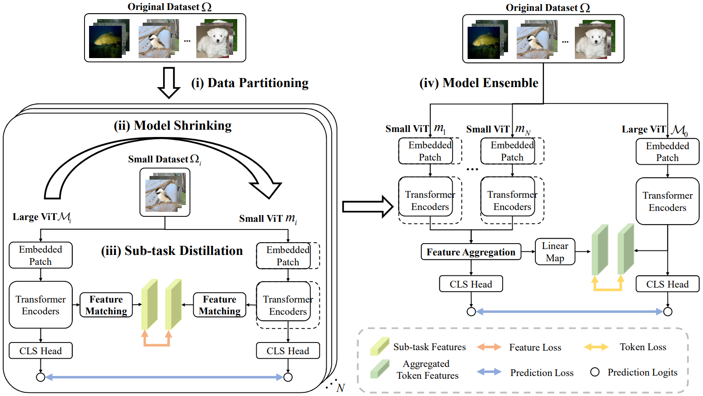

# DeViT: Decomposing Vision Transformers for Collaborative Inference in Edge Devices
PyTorch implementation of the paper: DeViT: Decomposing Vision Transformers for Collaborative Inference in Edge Devices

## About DeViT



We first propose a collaborative inference framework termed **DeViT** to facilitate edge deployment by decomposing large ViTs. Subsequently, we design a decomposition-and-ensemble algorithm based on knowledge distillation, termed DEKD, to fuse multiple small decomposed models while dramatically reducing communication overheads, and handle heterogeneous models by developing a feature matching module to promote the imitations of decomposed models from the large ViT. Extensive experiments for three representative ViT backbones on four widely-used datasets demonstrate our method achieve efficient collaborative inference for ViTs and outperforms existing lightweight ViTs, striking a good trade-off between efficiency and accuracy.


## Getting Started

### Dependencies
```
pytorch==1.8.1
torchvision==0.9.1
tqdm==4.65.0
timm==0.5.4
```


### Datasets

- ImageNet-1K
- CIFAR-100
- 102 Flowers
- Stanford Cars

### Training


- Split the dataset into sub-datasets according to the number of devices

  ```
  python3 splite_dataset.py --dataset cifar100 --data_path ./your_datasets --num_division 4 --output_path ./sub_datasets
  ```

- Train models with sub-datasets

  ```
  python -m torch.distributed.launch --nproc_per_node=8 --master_addr=127.0.0.1 --master_port=29501 --use_env train_subdata.py --batch-size 256 --eval-batch-size 512 --epochs 100 --model deit_base_distilled_patch16_224 --model-path ./ckpt.pth --model-ema --lr 1e-4 --data-path ./sub_datasets --dataset cifar100 --num_division 4 --start-division 0 --output_dir ./output 
  ```
  
- Distill sub-models

  ```
  python -m torch.distributed.launch --nproc_per_node=8 --master_addr=127.0.0.1 --master_port=29501 --use_env distill_sub.py --batch-size 256 --eval-batch-size 512 --epochs 100 --model dedeit --model-path ./ckpt.pth --model-ema --lr 8e-5 --data-path ./sub_datasets --dataset cifar100 --teacher-model deit_base_distilled_patch16_224 --teacher-path ./teacher_ckpt.pth --distillation-type hard --gama 0.2 0.1 0.3 --num_division 4 --start-division 0 --output_dir ./output 
  ```

- Ensemble

  ```
  python -m torch.distributed.launch --nproc_per_node=8 --master_addr=127.0.0.2 --master_port=29502 --use_env ensemble.py --batch-size 128 --eval-batch-size 256 --epochs 50 --model dedeit --model-path ./model_path --model-ema --lr 3e-4 --data-path ./datasets --dataset cifar100 --num_division 4 --output_dir ./output --teacher-model deit_base_distilled_patch16_224 --teacher-path ./teacher_ckpt.pth --sub_classes 25 25 25 25
  ```

  

### Evaluate

Evaluate the latency and energy consumption of inference on Jetson Nano and power monitor.

If you want to implement the evaluation with yourself, remember to set your Jetson Nano with the following commands:

```
# select power mode
sudo /usr/sbin/nvpmodel -m 1

# turn off DVFS
sudo jetson_clocks
```

